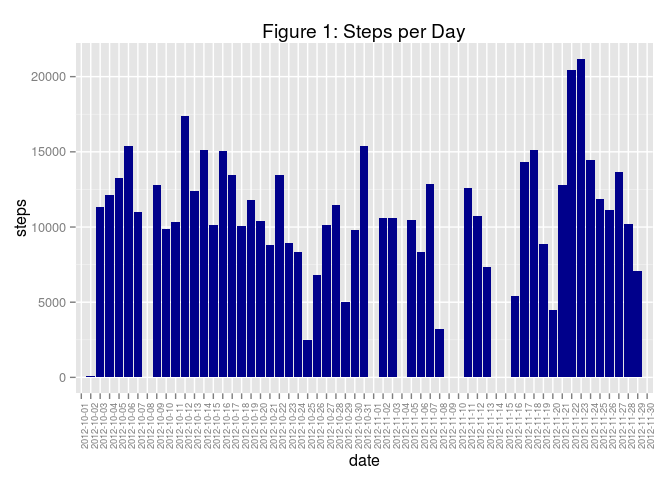
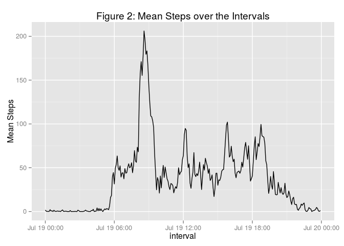
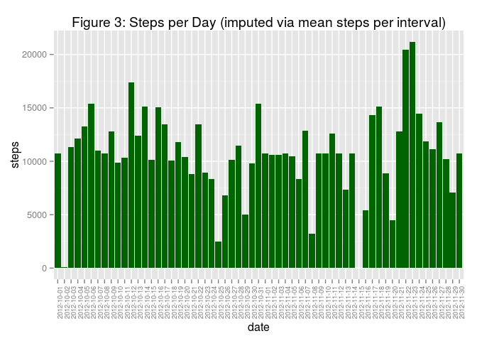
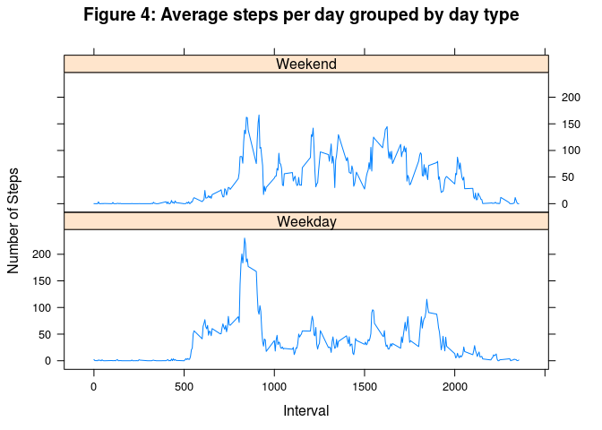

# Reproducible Research: Peer Assessment 1


## Loading and preprocessing the data

The data is read into the dataframe "data."  

```r
data <- read.csv("activity.csv")  ## read in the data
```

## What is mean total number of steps taken per day?


```r
library(plyr)
tpd <- ddply(data, "date", summarise, sum(steps, na.rm = TRUE)) ## find totals per day 
names(tpd) <- c("date", "steps") ## rename the dataframe
```
A sample of the data is shown

```r
head(tpd)
```

```
##         date steps
## 1 2012-10-01     0
## 2 2012-10-02   126
## 3 2012-10-03 11352
## 4 2012-10-04 12116
## 5 2012-10-05 13294
## 6 2012-10-06 15420
```

```r
library(ggplot2)
h <- ggplot(data=tpd, aes(x=date, y = steps)) ## create plot
h + geom_histogram(stat="identity", fill = "darkblue") +
        ggtitle("Figure 1: Steps per Day") +
        theme(axis.text.x = element_text(angle = 90, size = 7)) ## print and refine plot
```

 
Code to find the mean and median.

```r
mn <- mean(tpd$steps, na.rm=TRUE) ## find mean steps per day
md <- median(tpd$steps) ## find median steps per day
```
The mean number of steps per day is 9354.2295082 and the median is 10395.

## What is the average daily activity pattern?


```r
meanSteps <- tapply(data$steps, data$interval, mean, na.rm = TRUE) ## create vector of mean steps per inteveral
interval <- strptime(sprintf("%04d", as.numeric(names(meanSteps))), format="%H%M") ## prepare interval data for graph
```
A sample of the data is shown.

```r
head(meanSteps)
```

```
##         0         5        10        15        20        25 
## 1.7169811 0.3396226 0.1320755 0.1509434 0.0754717 2.0943396
```

```r
head(interval)
```

```
## [1] "2015-07-19 00:00:00 CDT" "2015-07-19 00:05:00 CDT"
## [3] "2015-07-19 00:10:00 CDT" "2015-07-19 00:15:00 CDT"
## [5] "2015-07-19 00:20:00 CDT" "2015-07-19 00:25:00 CDT"
```


```r
qplot(interval, meanSteps, geom="line", na.rm=TRUE, ylab = "Mean Steps",
      main = "Figure 2: Mean Steps over the Intervals") ## Plot the data
```

 

```r
Max <- as.character(interval[match(max(meanSteps), meanSteps)]) ## find the interval with max number of steps
```
The 5-minute interval, on average across all the days in the dataset, with the maximum number of steps is 2015-07-19 08:35:00.

## Imputing missing values

```r
numMissing <- colSums(is.na(data))  ## counts the missing data in the data set
```
The number of missing step data points is 2304.
No other data is missing in the table.

```r
index.NAs <- which(is.na(data$steps))  ## Create an index of rows with NAs 
steps <- data$steps ## import steps data to a vector for adding mean values
steps[index.NAs] <- meanSteps[paste(data$interval[index.NAs], "", sep = "")]  ## add in mean values
data.imputed <- data ## initialize dataframe for final concatenation
data.imputed$steps <- steps ## add imputed data
```


```r
tpd.imp <- ddply(data.imputed, "date", summarise, sum(steps)) ## find totals per day 
names(tpd.imp) <- c("date", "steps") ## rename the dataframe
```
A sample of the imputed data

```r
head(tpd.imp)
```

```
##         date    steps
## 1 2012-10-01 10766.19
## 2 2012-10-02   126.00
## 3 2012-10-03 11352.00
## 4 2012-10-04 12116.00
## 5 2012-10-05 13294.00
## 6 2012-10-06 15420.00
```


```r
h <- ggplot(data=tpd.imp, aes(x=date, y = steps)) ## create plot
h + geom_histogram(stat="identity", fill = "darkgreen") +
        ggtitle("Figure 3: Steps per Day (imputed via mean steps per interval)") +
        theme(axis.text.x = element_text(angle = 90, size = 7))  ## print and refine plot
```

 

```r
mn.imp <- as.integer(mean(tpd.imp$steps)) ## find mean steps per day (imputed dataset) 
md.imp <- as.integer(median(tpd.imp$steps)) ## find median steps per day (imputed dataset)
dif.mn <- as.integer(mn.imp - mn)
dif.md <- md.imp - md
```
<tidy = FALSE>The mean number of steps per day is 10766 and the median is 10766.

The mean with imputed values has a difference of 1411 from the mean with the missing values.

The median with imputed values has a difference of 371 from the median with the missing values.

Adding the imputed values raised the mean and median slightly.  Also, the median and mean from the imputed data are the same value, where the data with missing values had a difference between those measures.
<tidy = TRUE>

## Are there differences in activity patterns between weekdays and weekends?

Create a data set with a factor for weekdays and weekends.

```r
data.imputed$date <- as.POSIXct(data.imputed$date)
library(timeDate)
wday <- isWeekday(data.imputed$date, wday=1:5)
wday <- factor(wday, c(TRUE, FALSE), labels=c("Weekday", "Weekend"))
data.imp <- data.frame(data.imputed, wday)
```
A sample of the data is shown below

```r
head(data.imp)
```

```
##       steps       date interval    wday
## 1 1.7169811 2012-10-01        0 Weekday
## 2 0.3396226 2012-10-01        5 Weekday
## 3 0.1320755 2012-10-01       10 Weekday
## 4 0.1509434 2012-10-01       15 Weekday
## 5 0.0754717 2012-10-01       20 Weekday
## 6 2.0943396 2012-10-01       25 Weekday
```


```r
library(dplyr)
```

```
## 
## Attaching package: 'dplyr'
## 
## The following objects are masked from 'package:plyr':
## 
##     arrange, count, desc, failwith, id, mutate, rename, summarise,
##     summarize
## 
## The following object is masked from 'package:stats':
## 
##     filter
## 
## The following objects are masked from 'package:base':
## 
##     intersect, setdiff, setequal, union
```

```r
data.day <- data.imp %>%
        group_by(wday, interval) %>%
        summarize(totalsteps=sum(steps), average=mean(steps))
```
Graph of Average number of steps per day grouped by weekend or weekday

```r
library(lattice)
xyplot(average ~ interval | wday, data = data.day, layout = c(1,2), main = "Figure 4: Average steps per day grouped by day type", ylab = "Number of Steps", xlab = "Interval", type = "l")
```

 
